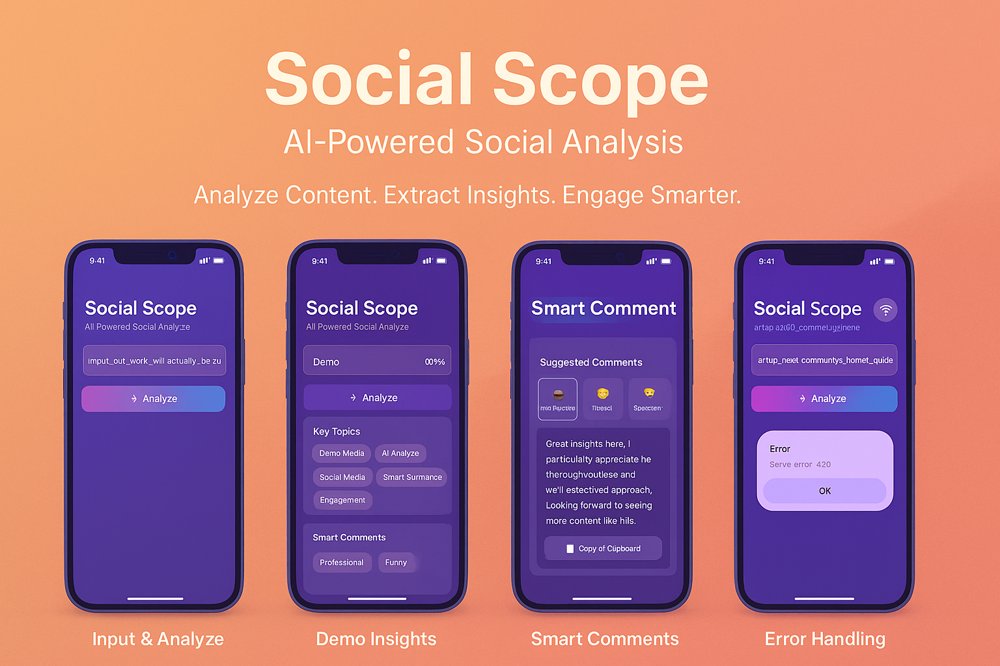
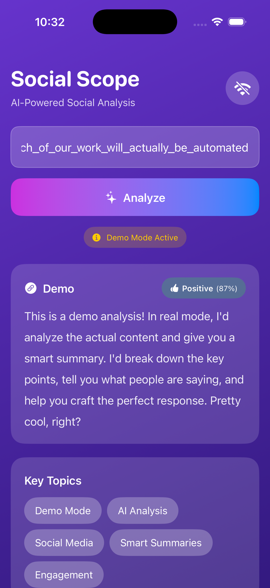

# 🧠 Social Scope

**AI-Powered Social Media Summarizer & Engagement Assistant**

Social Scope is a modern iOS app that uses artificial intelligence to analyze social media posts and help you engage meaningfully. Simply paste a post URL, and get an instant AI-powered summary, sentiment analysis, key topics, and a natural comment suggestion tailored to your preferred tone.

<p align="center">
  
  
  
  
  
</p>

---

## 📸 App Showcase

<p align="center">
  
</p>

> The brochure above shows the complete flow: input a URL, run analysis (demo or live), view key topics and sentiment, and copy a tone-adaptive smart comment.

## 🧾 Professional Summary

Social Scope is an iOS + FastAPI project that uses OpenAI to turn any social post into clear insights and ready-to-post, on‑brand replies. It analyzes the content, extracts sentiment and topics, and produces human‑sounding comments in four tones (Professional, Friendly, Funny, Supportive). The app features a polished SwiftUI interface with glassmorphism, haptics, and an offline demo mode for instant showcasing—backed by a clean, tested, and CI/CD‑enabled Python API.


---

## ✨ Features

### 📱 iOS App
- **Clean, Modern UI** — Apple-inspired design with gradient backgrounds and glassmorphism effects
- **URL Analysis** — Support for Twitter/X, Reddit, Medium, and more
- **AI-Powered Insights** — Get summaries, sentiment analysis, and topic extraction
- **Smart Comments** — AI generates natural, engaging comments in 4 different tones
- **Offline Demo Mode** — Try the app without a backend connection
- **Dark/Light Mode** — Seamless adaptation to system appearance
- **Haptic Feedback** — Rich tactile responses for better UX

### 🤖 Backend API
- **Fast & Scalable** — Built with FastAPI for high performance
- **OpenAI Integration** — Powered by GPT-4o-mini for accurate analysis
- **Multi-Platform Support** — Extract content from various social media platforms
- **Flexible Tone Control** — Professional, Friendly, Funny, or Supportive comments
- **RESTful API** — Clean, well-documented endpoints

---

## 🎯 Demo

### Analysis Flow
1. **Paste URL** → Enter any social media post URL
2. **Select Tone** → Choose your preferred comment style
3. **Analyze** → AI processes the post in seconds
4. **Engage** → Copy the suggested comment with one tap

### Example Output
```json
{
  "summary": "This post discusses AI's growing role in mobile development...",
  "sentiment": "Positive",
  "topics": ["AI", "Mobile Apps", "Swift"],
  "suggested_comment": "Great insights! I've noticed similar trends in iOS development recently."
}
```

### 🎬 Video Demo

<p align="left">
  <a href="assets/demo.mp4">
    
  </a>
  <br>
  <em>Click the image to watch the demo video</em>
</p>

---

## 💬 Testimonials

> “In minutes, I can triage dozens of posts and reply with comments that sound like us.” — Social Media Manager
>
> “The tone presets are spot‑on. I switch between Professional and Supportive depending on context.” — Marketing Lead
>
> “The demo mode is perfect for stakeholder walkthroughs—no backend required.” — Product Manager
>
> “Clean SwiftUI + FastAPI architecture. Great example of modern, testable full‑stack mobile.” — iOS Engineer

---

## 🏗️ Architecture

```
┌─────────────────────────────────────────────────────┐
│                   iOS App (SwiftUI)                 │
│  ┌────────────┐  ┌───────────┐  ┌────────────────┐  │
│  │   Views    │←→│ ViewModels│←→│   Services     │  │
│  └────────────┘  └───────────┘  └────────────────┘  │
└────────────────────────┬────────────────────────────┘
                         │ HTTP/REST
┌────────────────────────▼────────────────────────────┐
│              FastAPI Backend (Python)               │
│  ┌────────────┐  ┌───────────┐  ┌────────────────┐  │
│  │   Router   │→ │  Services │→ │  OpenAI API    │  │
│  └────────────┘  └───────────┘  └────────────────┘  │
└─────────────────────────────────────────────────────┘
```

**Frontend:** SwiftUI + MVVM + Combine  
**Backend:** FastAPI + OpenAI + BeautifulSoup  
**Communication:** RESTful JSON API

---

## 🚀 Getting Started

### Prerequisites

#### iOS App
- macOS 13.0+ with Xcode 15+
- iOS 15.0+ device or simulator
- Swift 5.9+

#### Backend
- Python 3.10+
- OpenAI API key ([Get one here](https://platform.openai.com/api-keys))

---

## 📦 Installation

### 1. Clone the Repository
```bash
git clone https://github.com/ZaighamFarid/SocialScope.git
cd SocialScope
```

### 2. Backend Setup

```bash
cd Backend

# Create virtual environment
python3 -m venv venv
source venv/bin/activate  # On Windows: venv\Scripts\activate

# Install dependencies
pip install -r requirements.txt

# Configure environment variables
cp .env.example .env
# Edit .env and add your OPENAI_API_KEY
```

**Start the backend server:**
```bash
chmod +x run.sh
./run.sh

# Or manually:
uvicorn app.main:app --reload
```

The API will be available at `http://localhost:8000`  
API docs: `http://localhost:8000/docs`

### 3. iOS App Setup

```bash
cd ../iOS-App
```

**Open the project in Xcode:**
```bash
open SocialScope.xcodeproj
# Or if using Swift Package
open Package.swift
```

**Update API Base URL** (if needed):
- Open `Core/Networking/APIService.swift`
- Update `baseURL` if your backend is not on localhost

**Run the app:**
- Select a simulator or device
- Press `Cmd + R` to build and run

---

## 🧪 Testing

### Backend Tests
```bash
cd Backend
pytest app/tests/ -v --cov=app
```

**Expected coverage:** ≥85%

### iOS Tests
```bash
cd iOS-App

# Run unit tests
xcodebuild test -scheme SocialScope -destination 'platform=iOS Simulator,name=iPhone 15'

# Or in Xcode: Cmd + U
```

---

## 🔧 Configuration

### Backend Configuration

**Environment Variables** (`.env`):
```env
OPENAI_API_KEY=sk-...
HOST=0.0.0.0
PORT=8000
```

### iOS Configuration

**API Service** (`Core/Networking/APIService.swift`):
```swift
private let baseURL = "http://localhost:8000"  // Change for production
```

---

## 📚 API Documentation

### Endpoints

#### `POST /analyze`
Analyze a social media post and generate engagement suggestions.

**Request:**
```json
{
  "url": "https://twitter.com/user/status/12345",
  "tone": "friendly"
}
```

**Response:**
```json
{
  "summary": "Post summary...",
  "sentiment": "Positive",
  "topics": ["AI", "Tech"],
  "suggested_comment": "Great insights!"
}
```

**Tone Options:**
- `professional` — Formal, respectful tone
- `friendly` — Casual, warm tone
- `funny` — Witty, humorous tone
- `supportive` — Encouraging, empathetic tone

#### `GET /health`
Health check endpoint.

**Full API docs:** Visit `/docs` when server is running

---

## 🎨 UI Components

### Custom SwiftUI Views
- **SummaryCardView** — Glass-style card for post summaries
- **SentimentTagView** — Color-coded sentiment badges
- **TopicBubbleView** — Flow layout for topic tags
- **SuggestedCommentView** — Copyable comment card
- **ToneButton** — Selectable tone chips

### Design System
- **Colors:** Purple/blue gradients with glassmorphism
- **Typography:** SF Pro (system font)
- **Icons:** SF Symbols
- **Animations:** Spring animations with haptic feedback

---

## 🛠️ Tech Stack

### iOS
| Technology | Purpose |
|------------|---------|
| SwiftUI | UI Framework |
| Combine | Reactive programming |
| async/await | Concurrency |
| XCTest | Testing framework |
| SwiftLint | Code quality |

### Backend
| Technology | Purpose |
|------------|---------|
| FastAPI | Web framework |
| OpenAI API | AI analysis |
| BeautifulSoup | Web scraping |
| Pydantic | Data validation |
| pytest | Testing |

---

## 📂 Project Structure

```
SocialScope/
├── iOS-App/
│   ├── App/                    # App entry point
│   ├── Modules/
│   │   └── Analyzer/           # Main feature module
│   │       ├── Views/          # SwiftUI views
│   │       ├── ViewModels/     # Business logic
│   │       ├── Models/         # Data models
│   │       └── Services/       # Network services
│   ├── Core/
│   │   ├── Networking/         # API client
│   │   └── Utilities/          # Helper functions
│   ├── Resources/              # Assets
│   └── Tests/                  # Test suites
│
└── Backend/
    ├── app/
    │   ├── main.py             # FastAPI app
    │   ├── routers/            # API endpoints
    │   ├── services/           # Business logic
    │   ├── models/             # Pydantic models
    │   ├── utils/              # Utilities
    │   └── tests/              # Test suites
    ├── requirements.txt        # Python dependencies
    └── .env.example            # Environment template
```

---

### Development Workflow
1. Fork the repository
2. Create a feature branch (`git checkout -b feature/amazing-feature`)
3. Commit your changes (`git commit -m 'Add amazing feature'`)
4. Push to the branch (`git push origin feature/amazing-feature`)
5. Open a Pull Request

### Code Style
- **Swift:** Follow [Swift API Design Guidelines](https://www.swift.org/documentation/api-design-guidelines/)
- **Python:** Follow [PEP 8](https://peps.python.org/pep-0008/)
- Use human-style, conversational comments

---

## 🐛 Troubleshooting

### Backend Issues

**"OPENAI_API_KEY not set"**
- Make sure you've created a `.env` file with your API key

**"Module not found"**
- Activate your virtual environment: `source venv/bin/activate`
- Reinstall dependencies: `pip install -r requirements.txt`

### iOS Issues

**"Cannot connect to localhost"**
- If testing on a real device, update `baseURL` to your Mac's IP address
- Make sure backend server is running

**Build errors**
- Clean build folder: `Cmd + Shift + K`
- Reset package cache: `File > Packages > Reset Package Caches`

---

## 📝 License

This project is licensed under the MIT License - see the [LICENSE](LICENSE) file for details.

---

## 👨‍💻 Author

**Your Name**  
- GitHub: [Zaigham Farid](https://github.com/ZaighamFarid)
- LinkedIn: [Zaigham Farid](https://linkedin.com/in/zaigham-farid)

---

## 🙏 Acknowledgments

- OpenAI for the GPT API
- FastAPI team for the amazing framework
- Apple for SwiftUI and SF Symbols
- The open-source community

---

## 📈 Roadmap

- [ ] Support for more social platforms (LinkedIn, Instagram)
- [ ] Multiple comment suggestions per post
- [ ] Comment tone slider for fine-tuning
- [ ] Share comment directly to apps
- [ ] Analytics dashboard
- [ ] Multi-language support

---

## 🌟 Star History

If you find this project useful, please consider giving it a ⭐️!

---
